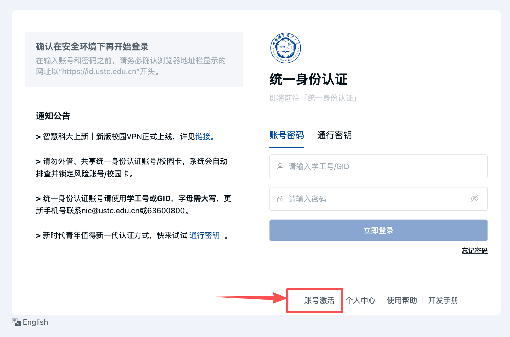
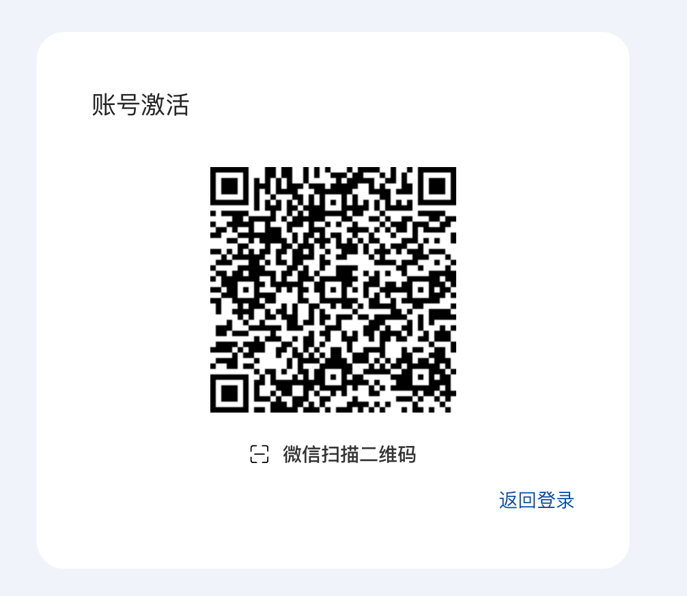
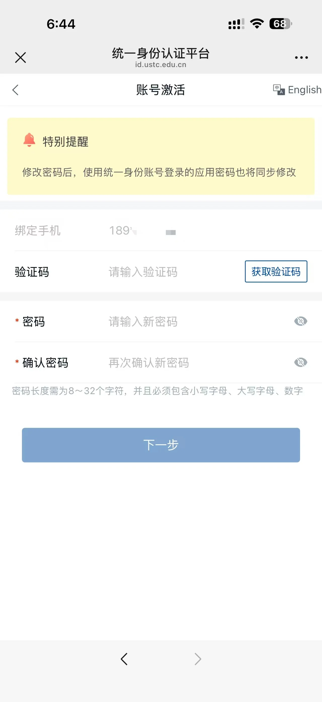

# 账号激活

首次使用统一身份认证账号时，请按照以下步骤完成账号激活。

## 1. 点击“账号激活”

打开[统一身份认证登录页面](https://id.ustc.edu.cn)，点击页面底部的“账号激活”。

## 2. 使用微信扫描二维码

进入账号激活页面后，使用微信扫描页面显示的二维码。

{ width="500" }

## 3. 输入学号

按照微信页面提示，输入本人学号。

## 4. 核验信息并设置密码

核验个人信息，接收并输入短信验证码，然后设置密码。操作完成后，账号即可激活。

!!! info "密码设置要求"
    密码长度为 8～32 个字符，且必须同时包含**大写字母、小写字母和数字**。

{ width="420" }

!!! warning "手机号提示"
    预留家长手机号的同学，请联系 **0551-63600800**，尽快更换为本人手机号。
