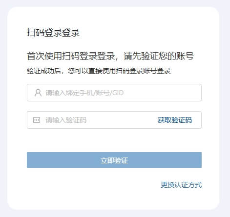
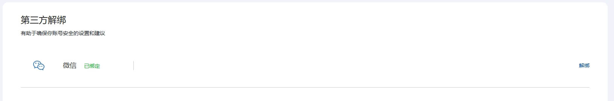

# 通知公告

---
## 2025-08-12 统一身份认证系统更新提示

各位师生、应用系统管理员、开发者：

新版身份认证系统将于**2025年8月13日**进行在线升级，升级期间服务不受影响，如果您遇到身份认证问题，请联系邮箱 [wf0229@ustc.edu.cn](mailto:wf0229@ustc.edu.cn)。

### 本次更新主要内容
```changelog
1. 灰度测试组件上线；
2. 接管电子注册中心GID相关功能；
3. 修复了一个水平越权漏洞（感谢SA23杨旭的反馈）。
```
---

## 2025-07-09 微信扫码登录结束测试，开放时间另行通知

各位师生：

经过一段时间测试，微信扫码功能仍无法缓解部分校内人员数据兼容性问题(主要是由于历史遗留的编码不规范导致)，因此该功能全面开放预计推迟至2025年秋季学期。

## 2025-03-26 微信扫码登录计划更新

各位师生：

身份认证系统微信登录功能预计**2025年3月26日更新**，本次更新不停服务。


### 常见问题

- **我在老系统启用了扫码登录，新系统能直接用吗？**  
  不行，需要重新关联。

- **如何使用微信登录？**  
  在登录页面选择微信登录，点击“微信快捷登录”或扫描二维码。首次使用需根据提示将微信账号关联至统一身份认证。



- **使用微信登录，微信账号会泄露吗？**  
  不会。微信不会将个人信息（包括微信号）提供给学校，您也可以在「个人中心 - 第三方绑定」取消关联。

- **如何取消微信关联？**  
  登录后在「个人中心 - 第三方绑定」中操作。



如遇问题，请联系邮箱 [wf0229@ustc.edu.cn](mailto:wf0229@ustc.edu.cn)。

---

## 2025-02-10 新版统一身份认证已切换

各位师生、应用系统管理员、开发者：

新版身份认证系统将于**2025年2月11日**起试运行，期间如遇问题，请联系邮箱 [wf0229@ustc.edu.cn](mailto:wf0229@ustc.edu.cn)。


### 常见问题

- **新版系统会影响我登录吗？**
  
  新版本继承了原有全部功能，仍可使用原账号和密码。需要注意：**原先“记住设备”（免短信验证）的设置需重新配置。**

- **新版系统网址不同吗？**
  
  是的，新版启用了新域名 `https://id.ustc.edu.cn`，原 `passport.ustc.edu.cn` 将自动跳转。

---

### 本次更新主要内容
```changelog
#### 面向师生用户

1. 新增动态口令（TOTP）认证，支持Microsoft Authenticator、谷歌身份验证器、腾讯身份验证器等。
2. 新增通行密钥（Passkey）认证，支持Windows、Mac、Android。
3. 新增账号权限委托功能。
4. 提升威胁识别和人机交互验证码能力。
5. 增加账号安全中心。

#### 面向开发者

1. 增加OAuth 2.0、OIDC 1.1支持，符合多项RFC规范。
2. 提供Android、iOS、鸿蒙SDK。
3. 支持校园身份校验（不返回身份标识符）。

#### 安全性配置

- 移除TLS 1.0 & 1.1支持（RFC8996）。
```
---

## 2024-01-17 计划更新

**2024年1月19日 21:30–22:00**将进行在线升级，第二批离校师生限制访问的业务系统将生效。

如提示“离校师生不支持登录”，请联系网络信息中心。

---

## 2023-11-15 系统更新说明

身份认证系统已完成在线升级。

**更新内容：**

- 停止离校师生访问 WebVPN、跨校资源认证中心、部分电子期刊。
- 未登记应用将提示「service无效」。

如需补充登记或修复权限，请联系网络信息中心。

---

## 2023-10-31 停止离校师生认证通知

自**2023年11月15日起**，第一批业务系统停止离校师生认证：

- WebVPN：https://wvpn.ustc.edu.cn
- 跨校资源认证中心：https://idp.ustc.edu.cn
- 电子期刊：https://*.lib.ustc.edu.cn

---

## 2023-08-31 封禁说明

因短信攻击，**222.73.141.0/24 段已封禁**。

---

## 2022-07-20 弱密码临时禁止登录

根据《中华人民共和国数据安全法》要求，**弱密码账号已临时停用**，需修改密码后恢复。

**弱密码包括：**

- 与账号相同
- 简单顺序（如123456、qwerty）
- 常见单词（password、admin）

**安全密码要求：**

- ≥8位，含以下三种类型：
  - 大写字母
  - 小写字母
  - 数字
  - 特殊符号（_ ! @ # $ % ^ & * - + =）

如需修改密码，请参考[密码重置流程](password_reset.md)。

---

