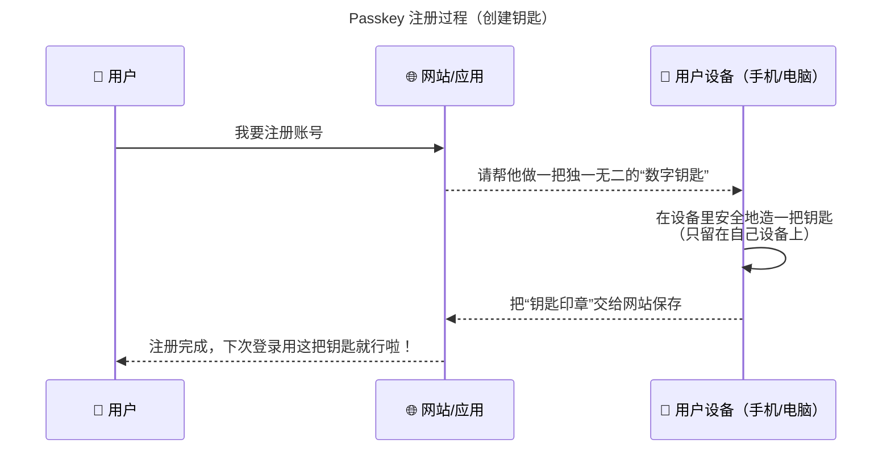
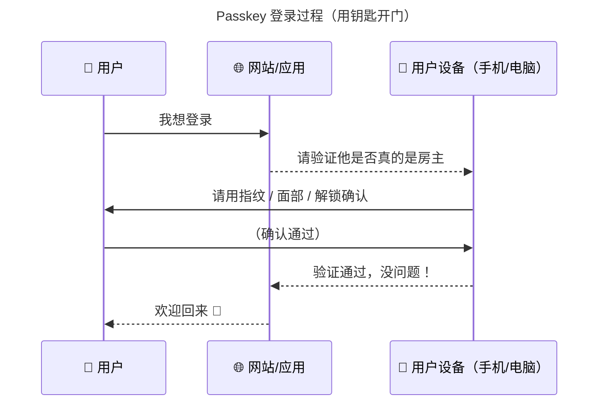

# 通行密钥

「通行密钥」是存储在你的移动设备上的加密密钥。通过验证你的生物信息（如指纹、面容识别）来验证这个密钥，无需输入复杂的密码，即可快速登录中国科大统一身份认证。

!!! warning "统一身份认证不存储你的生物信息如指纹、面容等"

    通行密钥这种登录方式的原理是将<span style="color:red">**个人可信设备**</span>（如电脑、手机等）注册至统一身份认证系统，认证逻辑是**你能解锁这个个人可信设备，证明你是设备的拥有者**，进而完成登录认证。

    更直观的一个类比是，将个人电脑、手机当成“银行优盾”，使用过程中用户使用PIN码、指纹、面容识别来解锁“优盾”，即可完成系统认证。
---





```
flowchart TB
    title Passkey 安全原理图（通俗理解）
    A[🚫 钓鱼网站] -->|骗不了钥匙| B[✅ 每个网站的钥匙都不同]
    C[🚫 密码泄露] -->|没密码可偷| D[✅ 钥匙藏在设备安全芯片]
    E[🚫 假网站] -->|验证失败| F[✅ 网站身份自动校验]
    G[🚫 重放攻击] -->|旧钥匙无效| H[✅ 每次登录都是新挑战]
    I[🚫 数据库泄露] -->|拿不到私钥| J[✅ 网站只存公钥印模]
```

## 「通行密钥」安全吗？

与传统密码相比，「通行密钥」更加安全，因为：

- **免受密码泄露的风险**  
  传统密码容易被泄露或猜测，尤其是在不同应用程序使用相同密码或弱密码的情况下。而「通行密钥」通过设备的生物识别进行验证，彻底消除了密码被破解、盗取或泄露的风险。

- **防止钓鱼攻击**  
  传统密码容易成为钓鱼攻击的目标，我们可能在不知情的情况下输入密码到伪造的网站。而「通行密钥」基于非对称加密的安全方案，登录过程中不需要输入密码，因此即使遭遇钓鱼攻击，攻击者也无法获取用户的登录信息。

- **基于设备和生物识别**  
  「通行密钥」是与特定设备绑定的，只保留在设备端，也只有通过设备的生物识别（如指纹、面容识别）才能完成登录。这意味着即使攻击者获取了设备，也无法通过自己的生物信息验证、访问账号。

通过这些机制，「通行密钥」提供了一种比传统密码更加可靠的安全保障。

---

## 如何为我的统一身份认证设置「通行密钥」？

你可以在登录页面点击“个人中心”，认证成功后在“个人中心”→“安全设置”→“通行密钥”中按照提示设置。  
目前支持：

- Windows（需要 Windows Hello）
- Mac
- iOS
- 原生 Android
- 大多数 OPPO、华为设备

---

## 如何使用「通行密钥」登录？

在添加了「通行密钥」的设备登录统一身份认证时：

1. 选择“通行密钥”
2. 输入账号
3. 按照提示操作即可

---

## 「通行密钥」安全性证明

详见: [https://doi.org/10.1109/SP46215.2023.10179454](https://doi.org/10.1109/SP46215.2023.10179454)

---

如在认证过程中遇到问题，请联系网络信息中心用户服务部：  
📧 邮箱： [nic@ustc.edu.cn](mailto:nic@ustc.edu.cn)  
📞 电话： +86-551-63600800

---
