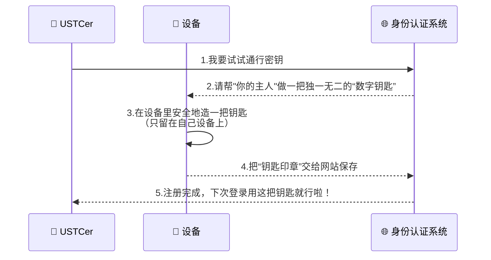
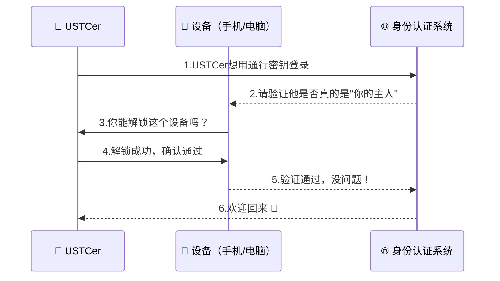
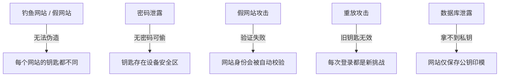

# 通行密钥

通行密钥（Passkey）采用基于椭圆曲线算法（ECC 或 EdDSA）的非对称加密技术（Public Key Cryptography）生成并管理公钥与私钥对。
通过这种方式，私钥始终安全地存储在本地设备的安全硬件（如 TPM 或 Secure Enclave）中，不会被导出或上传；服务器仅保存对应的公钥，用于在登录时验证签名。

在具体实现中，「通行密钥」实质上是存储于个人移动设备中的私钥。当设备通过指纹、人脸、PIN码、图形码等解锁方式验证机主身份后，会使用该私钥对统一身份认证系统下发的随机挑战（Challenge）进行签名。服务器收到签名并验证通过后，即确认用户身份，实现无需输入密码的安全登录。

## 「通行密钥」安全性证明

通行密钥协议的安全性证明发表在网络与信息安全领域顶级学术会议IEEE Symposium on Security and Privacy，详见：

[N. Binde, C. Cremers and M. Zhao, "FIDO2, CTAP 2.1, and WebAuthn 2: Provable Security and Post-Quantum Instantiation," 2023 IEEE Symposium on Security and Privacy (SP), San Francisco, CA, USA, 2023, pp. 1471-1490, doi: 10.1109/SP46215.2023.10179454.](https://doi.org/10.1109/SP46215.2023.10179454)

## 「通行密钥」 注册原理-制作钥匙

## 「通行密钥」 登录原理-使用钥匙

## 「通行密钥」安全吗？

通行密钥使用的是非对称加密技术PKI，与传统密码相比，「通行密钥」更加安全，因为：

- **免受密码泄露的风险**  
  传统密码容易被泄露或猜测，尤其是在不同应用程序使用相同密码或弱密码的情况下。而「通行密钥」通过设备的生物识别进行验证，彻底消除了密码被破解、盗取或泄露的风险。

- **防止钓鱼攻击**  
  传统密码容易成为钓鱼攻击的目标，我们可能在不知情的情况下输入密码到伪造的网站。而「通行密钥」基于非对称加密的安全方案，登录过程中不需要输入密码，因此即使遭遇钓鱼攻击，攻击者也无法获取用户的登录信息。

- **基于设备和生物识别**  
  「通行密钥」是与特定设备绑定的，只保留在设备端，也只有通过设备的生物识别（如指纹、面容识别）才能完成登录。这意味着即使攻击者获取了设备，也无法通过自己的生物信息验证、访问账号。

通过这些机制，「通行密钥」提供了一种比传统密码更加可靠的安全保障。

---

## 如何为我的统一身份认证设置「通行密钥」？

你可以在登录页面点击“个人中心”，认证成功后在“个人中心”→“安全设置”→“通行密钥”中按照提示设置。  
目前支持：

- Windows（需要 Windows Hello）
- Mac
- iOS
- 原生 Android
- 大多数 OPPO、华为设备

---

## 如何使用「通行密钥」登录？

在添加了「通行密钥」的设备登录统一身份认证时：

1. 选择“通行密钥”
2. 输入账号
3. 按照提示操作即可

---

如在认证过程中遇到问题，请联系网络信息中心用户服务部：  
📧 邮箱： [nic@ustc.edu.cn](mailto:nic@ustc.edu.cn)  
📞 电话： +86-551-63600800

---
