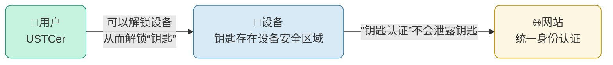

# 通行密钥

「通行密钥」是存储在你的移动设备上的加密密钥。通过验证你的生物信息（如指纹、面容识别）来验证这个密钥，无需输入复杂的密码，即可快速登录中国科大统一身份认证。

## 「通行密钥」安全性证明
[N. Binde, C. Cremers and M. Zhao, "FIDO2, CTAP 2.1, and WebAuthn 2: Provable Security and Post-Quantum Instantiation," 2023 IEEE Symposium on Security and Privacy (SP), San Francisco, CA, USA, 2023, pp. 1471-1490, doi: 10.1109/SP46215.2023.10179454.](https://doi.org/10.1109/SP46215.2023.10179454)

## 通行密钥 注册原理-创建钥匙

## 通行密钥 登录原理-使用钥匙

## 「通行密钥」安全吗？

与传统密码相比，「通行密钥」更加安全，因为：

- **免受密码泄露的风险**  
  传统密码容易被泄露或猜测，尤其是在不同应用程序使用相同密码或弱密码的情况下。而「通行密钥」通过设备的生物识别进行验证，彻底消除了密码被破解、盗取或泄露的风险。

- **防止钓鱼攻击**  
  传统密码容易成为钓鱼攻击的目标，我们可能在不知情的情况下输入密码到伪造的网站。而「通行密钥」基于非对称加密的安全方案，登录过程中不需要输入密码，因此即使遭遇钓鱼攻击，攻击者也无法获取用户的登录信息。

- **基于设备和生物识别**  
  「通行密钥」是与特定设备绑定的，只保留在设备端，也只有通过设备的生物识别（如指纹、面容识别）才能完成登录。这意味着即使攻击者获取了设备，也无法通过自己的生物信息验证、访问账号。

通过这些机制，「通行密钥」提供了一种比传统密码更加可靠的安全保障。

---

## 如何为我的统一身份认证设置「通行密钥」？

你可以在登录页面点击“个人中心”，认证成功后在“个人中心”→“安全设置”→“通行密钥”中按照提示设置。  
目前支持：

- Windows（需要 Windows Hello）
- Mac
- iOS
- 原生 Android
- 大多数 OPPO、华为设备

---

## 如何使用「通行密钥」登录？

在添加了「通行密钥」的设备登录统一身份认证时：

1. 选择“通行密钥”
2. 输入账号
3. 按照提示操作即可

---

如在认证过程中遇到问题，请联系网络信息中心用户服务部：  
📧 邮箱： [nic@ustc.edu.cn](mailto:nic@ustc.edu.cn)  
📞 电话： +86-551-63600800

---
