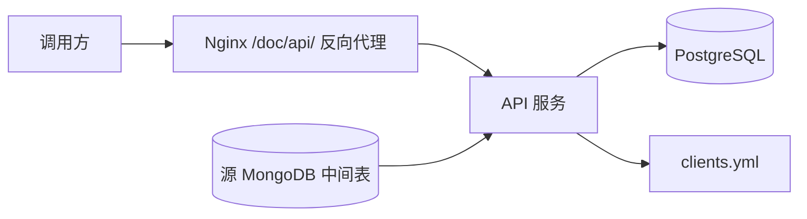

# 在校状态查询接口设计

## 背景

需要为 `https://id.ustc.edu.cn/doc/api/` 增加一个轻量查询接口。接口不需要管理后台，调用方通过配置文件授权。另一个系统提供 MongoDB 中间表，本服务每天同步一次三个字段：

- `gid`：业务中的 uuid，一个 `gid` 可对应多个 `zjhm`
- `zjhm`：业务中的 identity，全局不重复
- `ryzxztdm`：在校状态代码，接口原样返回

数据量预计 20 万到 30 万行。

## 目标

- 提供按 `gid` 或 `zjhm` 查询 `ryzxztdm` 的 HTTP API。
- 使用静态 token 和 IP/CIDR allowlist 做鉴权。
- 从 MongoDB 中间表每天同步一次数据到本服务数据库。
- 使用 Docker Compose 部署，便于和现有 `/doc/` MkDocs 服务通过反向代理共存。
- 暂不提供管理后台。

## 非目标

- 不在初版中提供在线配置管理界面。
- 不在初版中引入 Redis 缓存。PostgreSQL 索引足以支撑当前数据规模。
- 不在初版中解释 `ryzxztdm` 字典。后续拿到字典表后再增加解释字段或字典接口。
- 不直接实时查询源 MongoDB，以免查询接口受源系统可用性影响。

## 推荐架构

采用独立 API 服务 + PostgreSQL + 内置每日同步任务：



API 服务负责：

- 校验 token 和来源 IP。
- 提供查询接口。
- 每天定时从 MongoDB 拉取中间表数据，并 upsert 到 PostgreSQL。

PostgreSQL 负责保存查询快照。同步失败时保留上一版数据，查询接口继续使用旧数据。

## API 设计

所有业务接口位于 `/doc/api/` 路径下。

### 健康检查

`GET /doc/api/health`

返回：

```json
{
  "ok": true
}
```

健康检查可用于容器或反向代理探活。是否要求鉴权可在实现时配置，默认不要求鉴权。

### 按 gid 查询

`GET /doc/api/status/by-gid/{gid}`

成功返回：

```json
{
  "gid": "example-gid",
  "items": [
    {
      "zjhm": "example-zjhm",
      "ryzxztdm": "1"
    }
  ]
}
```

当 `gid` 不存在时返回 404：

```json
{
  "detail": "gid not found"
}
```

### 按 zjhm 查询

`GET /doc/api/status/by-zjhm/{zjhm}`

成功返回：

```json
{
  "gid": "example-gid",
  "zjhm": "example-zjhm",
  "ryzxztdm": "1"
}
```

当 `zjhm` 不存在时返回 404：

```json
{
  "detail": "zjhm not found"
}
```

## 鉴权设计

配置文件使用 YAML，例如 `config/clients.yml`：

```yaml
clients:
  - name: example-system
    enabled: true
    tokens:
      - "replace-with-token"
    allowed_ips:
      - "192.0.2.10/32"
      - "198.51.100.0/24"
```

鉴权规则：

- 请求必须带 `Authorization: Bearer <token>`。
- token 必须匹配一个 `enabled: true` 的客户端。
- 请求来源 IP 必须落在该客户端的 `allowed_ips` 范围内。
- 认证失败返回 401，IP 不允许返回 403。

部署在反向代理后时，API 服务只信任来自配置中可信代理的真实 IP 头，例如 `X-Forwarded-For` 或 `X-Real-IP`。如果请求不是来自可信代理，则使用直接连接 IP，避免调用方伪造来源地址。

## 数据库设计

主表：`identity_status`

| 字段 | 类型 | 说明 |
| --- | --- | --- |
| `gid` | text | 源字段 `gid` |
| `zjhm` | text | 源字段 `zjhm`，全局唯一 |
| `ryzxztdm` | text | 源字段 `ryzxztdm`，原样保存 |
| `synced_at` | timestamptz | 最近一次写入时间 |

约束和索引：

- `unique (zjhm)`
- `index (gid)`
- 可选 `unique (gid, zjhm)`，用于防止同一映射重复写入

## 同步设计

同步任务每天执行一次，配置项包含：

- MongoDB 连接串
- 数据库名
- 集合名
- 同步时间
- 批大小

同步流程：

1. 从 MongoDB 中间集合读取 `gid`、`zjhm`、`ryzxztdm`。
2. 跳过缺少 `gid` 或 `zjhm` 的异常记录，并记录日志。
3. 分批 upsert 到 PostgreSQL。
4. 记录同步开始时间、结束时间、读取行数、写入行数、跳过行数和错误信息。
5. 如果同步失败，不清空旧数据，接口继续使用上一次成功同步的数据。

初版采用全量同步。20 万到 30 万行数据规模较小，全量同步更容易验证，也能避免源 MongoDB 缺少变更时间字段时的增量一致性问题。

## 配置与部署

Docker Compose 初版包含：

- `api`：FastAPI 服务，提供查询接口和内置同步任务。
- `postgres`：本服务查询数据库。

推荐运行方式：

- API 服务监听容器内端口，例如 `8000`。
- Nginx 将 `https://id.ustc.edu.cn/doc/api/` 反向代理到 API 服务。
- 现有 MkDocs 继续服务 `/doc/` 下的静态文档。

反向代理需要确保 `/doc/api/` 优先匹配 API 服务，其他 `/doc/` 请求仍进入 MkDocs。

## 错误处理与日志

- 401：缺少 token 或 token 无效。
- 403：token 有效但来源 IP 不在 allowlist。
- 404：查询目标不存在。
- 500：服务内部错误。

日志至少包含：

- 鉴权失败的客户端 IP 和原因，但不记录完整 token。
- 查询接口的路径、状态码和耗时。
- 每次同步的统计信息。
- 同步失败的错误摘要。

## 测试策略

实现时采用测试先行：

- 鉴权测试：token 缺失、token 错误、IP 不允许、token 和 IP 同时通过。
- 查询测试：按 `gid` 查多条、按 `zjhm` 查单条、不存在返回 404。
- 同步测试：Mongo 记录 upsert 到 PostgreSQL、缺字段记录被跳过、同步失败保留旧数据。
- 配置测试：YAML 客户端配置加载和 CIDR 匹配。
- 部署校验：Docker Compose 能启动，API health check 可访问。

## 后续扩展

- 接入 `ryzxztdm` 字典表后，可增加状态解释字段，例如 `ryzxztmc`，同时保留原始 `ryzxztdm`。
- 如果 QPS 明显升高，可增加 Redis 缓存热点查询结果。
- 如果同步逻辑变复杂，可把内置同步任务拆成独立 worker 容器。
