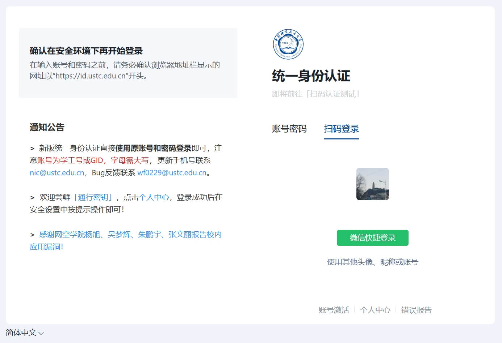
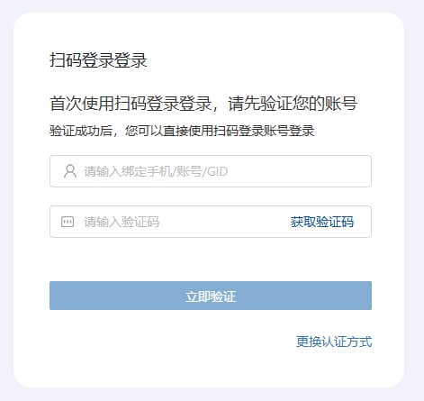
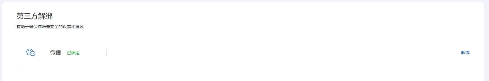

# 微信登录

## 如何使用微信登录？

在登录页面选择**微信登录**，点击「微信快捷登录」按钮，或者使用微信扫描二维码。  
首次使用时会提示将微信账户与统一身份认证绑定，按照页面提示操作即可。

---

## 使用微信登录，我的微信账号会不会泄露？

不会！  
微信不会将用户的个人信息（包括微信号）传递给我们。  
如果需要取消绑定，可以在「个人中心」→「第三方绑定」中操作。

---

## 取消微信关联统一身份认证

若需要取消微信与统一身份认证的绑定，可以在「个人中心」的**第三方绑定**中点击「解除关联」。

---

如在认证过程中遇到问题，请联系网络信息中心用户服务部：  
📧 邮箱： [nic@ustc.edu.cn](mailto:nic@ustc.edu.cn)  
📞 电话： +86-551-63600800

---